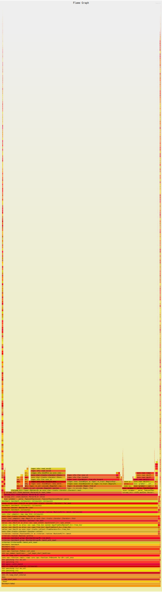

- [Prelude](#prelude)
- [Pirouette: parsing](#pirouette-parsing)
- [Macho: benchmarks](#macho-benchmarks)
- [Pantano: cache locality](#pantano-cache-locality)
- [Corrida: stage one](#corrida-stage-one)
- [Corrida: stage two](#corrida-stage-two)
- [Tango: JIT-компиляция](#tango-jit-компиляция)

## Prelude

Данный доклад не ставит собственной целью посвящение в тонкости написания парсеров, реализаций сколь-нибудь сложных систем типов или JIT компиляторов,
но в конце этого доклада наметятся реперные точки в экосистеме языка, которые позволят, не приближаясь к Азатоту, погрузиться в каждое из этих направлений
самостоятельно. Также я хотел бы внимательно остановиться на имеющихся ограничениях экосистемы, как относительно других языков, так и относительно
идеала.

Начать хотелось бы с того, что же такое парсинг и что нам, разработчикам, хотелось бы от средств его осуществляющего. Парсинг -- процесс
преобразования исходного набора символов (может быть как UTF-8 символами, так и битами) сначала в лексемы, а потом и в структуры, которыми 
будет оперировать логика программы [1]. От инструментов же мы хотим три вещи:

1. Гарантии корректности: если речь идёт про свободные от контекста грамматики, мы хотим, чтобы лексемы и структуры разбирались однозначным
   образом и не хотим давать эти гарантии методом внимательного взгляда. Например, `nom` без ошибок компилирует и исполняет следующий код:
   
   ```rust
   use nom::{
       branch::alt, bytes::complete::tag, combinator::value, multi::separated_list1, sequence::tuple,
       IResult, Parser,
   };

   pub enum Query {
       Not(Box<Self>),
       And(Vec<Self>),
       Or(Vec<Self>),
       Value(bool),
   }
   
   fn bool(source: &str) -> IResult<&str, Query> {
       alt((value(true, tag("true")), value(false, tag("false"))))
           .map(Query::Value)
           .parse(source)
   }
   
   fn many2<'i, Par: Fn(&'i str) -> IResult<&str, P>, P, Sep: Fn(&'i str) -> IResult<&str, S>, S>(
       mut parser: Par,
       separator: Sep,
       source: &'i str,
   ) -> IResult<&str, Vec<P>> {
       let (rest, first) = parser(source)?;
       let (rest, mut many) = separated_list1(separator, &mut parser)(rest)?;
       many.push(first);
       Ok((rest, many))
   }
   
   fn not(source: &str) -> IResult<&str, Query> {
       tag("-")
           .and_then(query)
           .map(|q| Query::Not(q.into()))
           .parse(source)
   }
   
   pub fn query(source: &str) -> IResult<&str, Query> {
       let or = |source| many2(query, tag("|"), source);
       let and = |source| many2(query, tag("|"), source);
       let bracketed = tuple((tag("("), query, tag(")"))).map(|(_, q, _)| q);
       alt((bool, not, or.map(Query::Or), and.map(Query::And), bracketed))(source)
   }
   ```

   LALRPOP же отказывается компилировать следующий код, мотивируя это тем, что `And` и `Or` -- одно и то же:

   ```lalrpop
   Many2<Element, Delimiter>: Vec<Element> = <mut elements:(<Element> Delimiter)+> <last: Element> => {
   	elements.push(last);
   	elements
   };
   
   Boolean: bool = { "true" => true, "false" => false };
   Value: Query = Boolean => Query::Value(<>);
   
   NotInner = { Value, "(" <Or> ")", "(" <And> ")" };
   Not: Query = "-" <NotInner> => Query::Not(<>.into());
   
   AndOrLeaf = { Value, "(" <Or> ")", "(" <And> ")", Not}
   And: Query = Many2<AndOrLeaf, "|"> => Query::And(<>);
   Or: Query = Many2<AndOrLeaf, "|"> => Query::Or(<>);
   
   pub Query: Query = {
   	Value, And, Or, Not,
    }
   ```

2. Эргономика: помимо соображений эстетики, не хотелось бы увеличивать сложность там, где можно было бы этого избежать:
   1. Ранее `NOM` использовал множество макросов, которые заметали под ковёр неказистость архитектуры типов. Сейчас макросы умерли,
      а нормальные типы так и не родились. В итоге композиция парсеров происходит больно, а содержание ошибок крайне усложняет отладку.
   2. `pest` не позволяет создавать пользовательские структурированные ошибки (только текстовые), не позволяет иметь пользовательский
      контекст парсинга (из-за чего вся нетривиальная валидация будет происходить уже после парсинга дерева синтаксиса).
   3. `chumsky` предоставляет потрясающие сообщения об ошибках, но даже такая простая вещь как парсинг чисел с плавающей точкой
      там выглядит так:
      ```rust
      use chumsky::{
          prelude::Simple,
          primitive::just,
          text::{digits, int},
          Parser,
      };
      
      fn float() -> impl Parser<char, f64, Error = Simple<char>> {
          let frac = just('.').chain(digits(10));
      
          let exp = just('e')
              .or(just('E'))
              .chain(just('+').or(just('-')).or_not())
              .chain::<char, _, _>(digits(10));
      
          just('-')
              .or_not()
              .chain::<char, _, _>(int(10))
              .chain::<char, _, _>(frac.or_not().flatten())
              .chain::<char, _, _>(exp.or_not().flatten())
              .collect::<String>()
              .from_str()
              .unwrapped()
              .labelled("float")
      }
      ```

3. Производительность: для части применений (такими я занимаюсь в своей каждодневной работе) объём разбираемых данных может быть огромным и
   даже парсинг может стать узким местом. Потому хотелось бы взять инструмент, который обеспечивает максимальную производительность при
   соблюдении первых двух пунктов.

Ниже хотелось бы дать обзорную таблицу библиотек парсинга, которые получили широкое распространение. Я проставлю каждой библиотеке оценку по
каждому из интересующих меня параметру от одного до пяти. Я сознательно не добавляю малоизвестные решения вроде `plex` и `reformation` либо
в силу ограниченности применений, либо в силу низкой распространённости (что повышает шансы нарваться на баг или смерть инфраструктуры).

|                    | NOM                                    | Combine                                   | Chumsky | pest | peg | LALRPOP |
|--------------------|----------------------------------------|-------------------------------------------|---------|------|-----|---------|
| Гарантии           | 0                                      | 0                                         | 0       | 0    | 0   | 5       |
| Эргономика         | 1 (макросы умерли, трейты не родились) | 4 (рекурсивные правила определять больно) | 4       | 3    | 3   | 4       |
| Производительность | 5                                      | 5 (с версии 3 аналогична nom)             | 2       | 2    | 2   | 4       |

[1] Alexis King. Parse, Don't validate: [оригинал](https://lexi-lambda.github.io/blog/2019/11/05/parse-don-t-validate/), [перевод](https://habr.com/ru/post/498042/).

## Pirouette: parsing

Разбирать мы будем язык математических вычислений следующего вида:

```rust
fn constant() = 42.0;

fn double(fst, snd) = fst * snd;

fn triple(fst, snd, thrd) = double(fst, snd) * thrd;

cos(triple(2.0, constant() * pi(), 8.0 / 2.0))
```

То есть нам хочется:

1. Базовые математические операции над числами с плавающей точкой: сложение, вычитание, деление, умножение.
2. Функции.
    1. Встроенные: `sin`, `cos`, `log`, `pi`.
    2. Определяемые пользователем: с глобальной областью видимости **уже определённых** функций, без
       форсирования вычислений (позволит экспериментировать с ленивыми вычислениями).

По имеющимся у нас запросам можно представить следующую структуру:

```rust
pub enum Expression<V> {
    Value(V),

    Op {
        left: Box<Self>,
        op: Operation,
        right: Box<Self>,
    },

    FnCall {
        function: Function,
        arguments: Vec<Self>,
    },
}
```

Генерализация нужна нам для того, чтобы на уровне типов выразить ограничения на то, что может являться элементом
функций (числа и аргументы) и выражения в конце (только числа).

Операции будут представлены следующим перечислением:

```rust
pub enum Operation {
    Sum,
    Mul,
    Div,
    Sub,
}
```

В качестве парсер-генератора мы возьмём LALRPOP; для описания грамматики он использует свой язык, основы которого я приведу ниже.

```rust
// Мы можем импортировать структуры, определённые в нашем
// (или чьём-то ещё) крейте:
use crate::Name;

// Здесь мы можем (но пока не будем) указывать контекст
// парсинга и времена жизни.
grammar;

// Здесь мы непосредственно определяем парсер.
//
// Expression -- название парсера, в нативном коде можно
// будет вызвать как `ExpressionParser::new()`.
//
// Name -- тип значения, которое мы пытаемся разобрать.
pub(crate) Expression: Name = {
    "(" <r"\p{alpha}+"> ")" => Name::new(<>),
/*  \1/ \------2------/ \3/    \-----4-----/

    1. Открывающая скобка.
    2. Имя.
      1) Угловые скобки нужны для того, чтобы захватить часть выражения.
      2) `r` сигнализирует о том, что мы хотим использовать регулярные выражения.
    3. Закрывающая скобка.
    4. Сборка структуры `Name`.
      3) Угловые скобки используются для того, чтобы подставить безымянное
         выражение 2.1 в вызов `new`. Если бы безымянных выражений было несколько,
         они бы подставились через запятую. */

    "[" <r"\p{alpha}+"> "]" =>? {
        // `=>?` говорит нам о том, что попытка собрать
        // `Name` может окончится ошибкой.
        let result = Name::try_new(<>)?,
        // Я не хочу руками конвертировать тип ошибки,
        // потому воспользуемся встроенным в Rust механизмом.
        Ok(result)
    },
}
```

Грамматика нашего калькулятора будет иметь следующий вид:

```rust
use std::str::FromStr;
use crate::prelude::*;

grammar(context: &mut Context);

extern {
    // LALRPOP поддерживает пользовательские ошибки
    // указать её тип можно следующим образом:
    type Error = Error;
}

// Здесь мы определяем парсер, который разбирает список
// в скобках.
//
// Тип списка (парсер, который способен разобрать его элемент)
// передаётся аргументом `T`.
Args<T>: Vec<T> = {
    // Система макросов LALRPOP поддерживает опциональные
    // и множественные срабатывания парсера.
    //
    // Здесь (<T> ",") может срабатывать ноль и более раз,
    // а последнего элемента может не быть вовсе.
    "(" <mut args: (<T> ",")*> <last: T?> ")" => {
        if let Some(last) = last {
            args.push(last);
        }
        args
    }
}

// Здесь мы разбираем операции, имеющие низкий приоритет.
ExprOp: Operation = {
    "+" => Operation::Sum,
    "-" => Operation::Sub,
}

// Здесь мы разбираем операции, имеющие высокий приоритет.
FactorOp: Operation = {
    "*" => Operation::Mul,
    "/" => Operation::Div,
}

Float: f64 = r"-?\d+(\.\d*)?" => f64::from_str(<>).unwrap();
Name: String = r"\p{alpha}+" => <>.into();

FunctionValue: FunctionValue = {
    Float => <>.into(),
    Name => <>.into(),
}

Term<Value>: Expression<Value> = {
    Value => Expression::Value(<>),

    // Скобки подымают приоритет операции,
    // потому выражение в скобках имеет такой же
    // приоритет, как и значение.
    "(" <Expression<Value>> ")",

    // Здесь мы сначала разбираем имя функции, а потом
    // аргументы, перечисленные в скобках.
    //
    // Аргументы не обязательно должны быть представлены
    // числами, но также могут быть представлены выражениями.
    //
    // Для получения информации о функции, которую мы пытаемся
    // вызвать, мы обращаемся к контексту. Так как эта операция
    // может завершиться ошибкой, мы говорим об этом LALRPOP
    // при помощи `=>?` и в правой части возвращаем Result.
    <name:Name> <arguments:Args<Expression<Value>>> =>? {
        let call = Expression::function_call(context, name, arguments)?;
        Ok(call)
    }
}

Tier<Value, Operation, Right>: Expression<Value> = {
    Tier<Value, Operation, Right> Operation Right => Expression::op(<>),
    Right,
}

// Операции с высоким приоритетом должны склеиваться друг с другом
// в выражение, потому правая часть от операции в Factor является числом,
// скобками или вызовом функции.
Factor<Value> = Tier<Value, FactorOp, Term<Value>>;

// Для операций с низким приоритетом правой частью от оператора может
// выступать только операция с высоким приоритетом, вырожденным случаем
// которого является числовое значение.
Expression<Value> = Tier<Value, ExprOp, Factor<Value>>;

// Парсинг функции не возвращает нам какого-то значения, а просто добавляет
// информацию о функции в контекст.
Function: () = {
    // Разбор функции также может приводить к ошибкам (использование неопределённой
    // переменной или вызов неопределённой функции). По этой причине также
    // используется `=>?`.
    "fn" <n:Name> <args: Args<Name>> "=" <expr:Expression<FunctionValue>> ";" =>? {
        let function = UserDefinedFunction::new(n.clone(), args, expr)?;
        context.add_function(n, function)?;
        Ok(())
    }
}

pub TopLevelExpression: Expression<f64> = {
    // Пользовательский ввод может иметь ноль и более определённых функций
    // и выражение, в которых они используются:
    Function* <r:Expression<Float>> => r,
}
```

Тестировать парсеры сложных рекурсивных грамматик руками дело неблагодарное, если есть
возможность -- лучше генерировать данные автоматически. У нас такая возможность есть,
реализовывать её будем через генерацию заведомо корректных деревьев при помощи `proptest`,
перегонку в строку с последующим парсингом обратно. К моменту, когда фарш провернётся
обратно -- можно вычислить и сравнить результаты.

Для числового значения уже имеется генератор, наша задача лишь отсечь значения, операции
над которыми гарантировано приведут к несравнимому результату (NaN, -NaN, Inf).

```rust
pub fn value() -> impl Strategy<Value = f64> + Clone {
    any::<f64>().prop_filter("Values must be comparable.", |x| x.is_normal())
}
```

Значением для функции может быть как число, так и значение аргумента. Мы не хотим использовать
аргументы также часто, как числа, потому задаём отношение при помощи `=>` синтаксиса макроса
`prop_oneof`.

```rust
pub fn function_value(variables: Vec<String>) -> impl Strategy<Value = FunctionValue> + Clone {
    prop_oneof![
        // Число должно генерироваться в пять раз чаще, чем переменная.
        5 => value().prop_map(FunctionValue::Float),
        1 => select(variables).prop_map(FunctionValue::Variable)
    ]
}
```

Генерация данных для парсинга идёт обратной ему, парсингу, дорогой, потому нам нужно сгенерировать часть
выражения, которую разбирает `TermParser`. Так как мы хотим использовать этот генератор и для
генерации выражения верхнего уровня, и для генерации функций, нам нужно будет прокинуть
генератор значения и список доступных функций.

```rust
fn term<S: Strategy<Value = V> + Clone + 'static, V: Clone + Debug + 'static>(
    value_strategy: S,
    user_defined_functions: Vec<Arc<UserDefinedFunction>>,
) -> impl Strategy<Value = Expression<V>> {
    prop_oneof![
        // Число должно генерироваться в десять раз чаще, чем вызов функции.
        10 => value_strategy.clone().prop_map(Expression::Value),
        1 => function_call(value_strategy, user_defined_functions),
    ]
}
```

Определяемую пользователем функцию мы можем получить следующим образом:

```rust
fn user_defined_function(
    functions: Vec<Arc<UserDefinedFunction>>,
) -> impl Strategy<Value = UserDefinedFunction> {
    (
        // Имя функции имеет длину от восьми до шестнадцати символов и состоит из
        // символов класса `alpha`.
        r"\p{alpha}{8,16}",
        // Функция имеет от двух до пяти аргументов. Каждый аргумент имеет имя,
        // состоящее из символов класса `alpha` и содержащие от трёх до семи
        // символов.
        //
        // Так как имена аргументов не должны совпадать, генерировать мы будем `HashSet`.
        proptest::collection::hash_set(r"\p{alpha}{3,7}", 2..5),
    )
        .prop_flat_map(move |(name, args)| {
            let args = args.into_iter().collect::<Vec<_>>();
            expression(function_value(args.clone()), functions.clone()).prop_map(
                move |expression| UserDefinedFunction {
                    name: name.clone(),
                    args: args.clone(),
                    expression,
                },
            )
        })
}
```

Вызов функции так:

```rust
fn function_call<S: Strategy<Value = V> + Clone + 'static, V: Clone + Debug + 'static>(
    value_strategy: S,
    user_defined_functions: Vec<Arc<UserDefinedFunction>>,
) -> impl Strategy<Value = Expression<V>> {
    // Если пользовательских функций нет, то создаём только встроенные.
    // Если на пустом векторе позвать `select`, получим ошибку генерации данных.
    if user_defined_functions.is_empty() {
        any::<BuiltinFunction>()
            .prop_map(Into::<Function>::into)
            // Боксирование происходит, чтобы не разошлись типы выражений,
            // возвращаемых if-else.
            .boxed()
    } else {
        prop_oneof![
            // Функции, которые определены пользователем, используются в десять раз реже
            // встроенных функций.
            1 => select(user_defined_functions.clone()).prop_map(Function::UserDefined),
            10 => any::<BuiltinFunction>().prop_map(Into::<Function>::into),
        ]
        .boxed()
    }
    .prop_flat_map(move |function| {
        prop::collection::vec(
            // Генерируем аргументы функции:
            expression(value_strategy.clone(), user_defined_functions.clone()),
            function.arguments_count(),
        )
        .prop_map(move |arguments| Expression::FnCall {
            function: function.clone(),
            arguments,
        })
    })
}
```

Операцию с высоким приоритетом так:

```rust
fn factor<S: Strategy<Value = V> + Clone + 'static, V: Clone + Debug + 'static>(
    strategy: S,
    user_defined_functions: Vec<Arc<UserDefinedFunction>>,
) -> impl Strategy<Value = Expression<V>> {
    // Так как `factor` определяется рекурсивно, мы хотим ограничить глубину рекурсии, чтобы не
    // пробить стэк при генерации данных. Для этого `proptest` предоставляет метод `prop_recursive`,
    // где первым аргументом идёт максимальная глубина рекурсии, вторым желаемое количество элементов,
    // а третьим желаемая глубина рекурсии. Четвёртым же элементом идёт функция, которая единственным
    // элементом принимает стратегию получения `factor`, которую мы можем использовать для рекурсивного
    // определения.
    term(strategy.clone(), user_defined_functions.clone())
        .prop_recursive(4, 16, 4, move |inner| {
            (
                inner,
                prop_oneof![Just(Mul), Just(Div)],
                term(strategy.clone(), user_defined_functions.clone()),
            )
                .prop_map(|(left, op, right)| Expression::op(left, op, right))
        })
}
```

Операцию с низким приоритетом так:

```rust
fn expression<S: Strategy<Value = V> + Clone + 'static, V: Clone + Debug + 'static>(
    value_strategy: S,
    user_defined_functions: Vec<Arc<UserDefinedFunction>>,
) -> impl Strategy<Value = Expression<V>> {
    factor(value_strategy.clone(), user_defined_functions.clone())
        .prop_recursive(4, 16, 4, move |inner| {
            (
                inner,
                prop_oneof![Just(Sum), Just(Sub)],
                factor(value_strategy.clone(), user_defined_functions.clone()),
            )
                .prop_map(|(expr, op, factor)| Expression::op(expr, op, factor))
        })
        .boxed()
}
```

```rust
// Набор функций, которые будут использоваться в выражении, будет определён рекурсивно.
// Делается это потому, что одни функции могут ссылаться на другие (определённые ранее).
fn functions() -> impl Strategy<Value = Vec<Arc<UserDefinedFunction>>> {
    // В качестве вырожденного случая будет использоваться функция, которая не ссылается ни
    // на какие другие функции.
    user_defined_function(Vec::new())
        .prop_map(|f| vec![Arc::new(f)])
        // Мы будем рекурсивно расширять перечень доступных функций следующим образом:
        .prop_recursive(16, 128, 16, |inner| {
            inner.prop_flat_map(|fs| {
                user_defined_function(fs.clone()).prop_map(move |f| {
                    let mut fs = fs.clone();
                    fs.push(f.into());
                    fs
                })
            })
        })
        // Имена функций обязаны быть уникальными, здесь мы делаем соответствующую проверку:
        .prop_filter("functions must be unique", |functions| {
            let names: HashSet<&str> = functions.iter().map(|f| f.name.as_str()).collect();
            names.len() == functions.len()
        })
}
```

Ну и всё выражение следующим образом:

```rust
pub fn top_level_expression() -> impl Strategy<Value = Expression<f64>> {
    // Сначала мы генерируем функции, которые планируем использовать, после чего генерируем
    // выражение:
    functions().prop_flat_map(|user_defined_functions| expression(value(), user_defined_functions))
}
```

Теперь, как и планировалось, можно определить тест следующим образом:

```rust
proptest! {
    // Мы хотим сгенерировать тысячу деревьев:
    #![proptest_config(ProptestConfig::with_cases(1_000))]
    // Запускаться это будет как обычный тест:
    #[test]
    // Результат вычисления должен быть сравним, потому мы добавим фильтр,
    // который проверяет, что он является нормальным значением.
    fn parse(expr in top_level_expression().prop_filter("Result must be comparable.", |e| e.evaluate().is_normal())) {
        // Вычисляем выражение:
        let evaluate_source = expr.evaluate();
        // Переводим выражение в строку:
        let stringified = format!("{expr}");
        // Разбираем выражение из строки обратно:
        let parsed = TopLevelExpressionParser::new().parse(&mut Context::from_expression(&expr), &stringified).unwrap();
        // Вычисляем выражение, которое разобралось из строки:
        let evaluate_parsed = parsed.evaluate();
        // Сравниваем, что результаты вычисления равны:
        prop_assert_eq!(evaluate_source, evaluate_parsed);
    }
}
```

В дальнейшем мы будем производить тесты производительности разбора и
вычисления. 
В связи с этим есть два соображения:

1. Хотелось бы иметь одни и те же данные для тестов.
2. Хотелось бы переиспользовать инфраструктуру для генерации тестовых
   данных, чтобы не писать лишний код.

В связи с этими соображениями рождается следующий код:

```rust
// Генерируем одно корректное выражение:
pub fn gen_correct_expression() -> Expression<f64> {
    let mut runner = TestRunner::default();
    crate::properties::top_level_expression()
        .new_tree(&mut runner)
        .unwrap()
        .current()
}

// Склеиваем из корректных выражений большее при помощи операции
// с низким приоритетом.
pub fn generate_expression_size(size: usize) -> Expression<f64> {
    let mut current = 0usize;
    let mut result = Expression::Value(11.0);

    while current < size {
        let generated = gen_correct_expression();
        current += generated.leafs_count();
        result = Expression::op(result, Operation::Sub, generated);
    }

    result
}

// Генерируем вектор из выражений, размер каждого варьируется в отрезке.
pub fn generate_dataset(size: usize, range: RangeInclusive<usize>) -> Vec<Expression<f64>> {
    (0..size)
        .map(move |_| rand::thread_rng().gen_range(range.clone()))
        .map(generate_expression_size)
        .collect()
}

// При помощи частичного применения делаем генератор по-умолчанию.
pub fn generate_default_dataset() -> Vec<Expression<f64>> {
    generate_dataset(3_000, 900..=950)
}

// Функция десериализации тестового набора данных. Данные сжимаются
// при помощи нативного компрессора LZ4, за счёт чего используется
// меньше места на диске.
pub fn read_dataset<P: AsRef<Path>>(path: P) -> Vec<Expression<f64>> {
    let file = std::fs::File::open(path).unwrap();
    let mut reader = std::io::BufReader::new(file);
    let mut buffer = Vec::new();
    reader.read_to_end(&mut buffer).unwrap();
    let buffer = lz4_flex::decompress_size_prepended(&buffer).unwrap();
    bincode::deserialize(&buffer).unwrap()
}

// Функция сериализации тестового набора данных.
pub fn write_dataset<P: AsRef<Path>>(path: P, dataset: Vec<Expression<f64>>) {
    let file = std::fs::File::create(path).unwrap();
    let mut file = std::io::BufWriter::new(file);
    let dataset = bincode::serialize(&dataset).unwrap();
    let dataset = lz4_flex::compress_prepend_size(&dataset);
    file.write_all(&dataset).unwrap();
}

pub const DEFAULT_DATASET: &str = "./data/expression_3k.bin.lz4";

#[test]
#[ignore = "For dataset generation only."]
fn generate_dataset_test() {
    let dataset = generate_default_dataset();
    write_dataset(DEFAULT_DATASET, dataset.clone());
    let deserialized = read_dataset(DEFAULT_DATASET);
    assert_eq!(dataset, deserialized);
}
```

## Macho: benchmarks

Переходя к тестированию производительности, хотелось бы уточнить, чего мы
от него хотим:

1. Локальности измерений: делая оценку производительности вычислителя, мы не
   хотим измерять что-то ещё (например, десериализацию данных), потому утилита
   тестирования должна уметь предоставлять средства ограничения измерений.
2. Интеграция с профилировщиком: мы хотим узнать не только общее время участка
   кода, но ещё и построить граф выполнения функций с детальным временем
   исполнения.
3. Знание об особенностях энергосбережения современных процессоров: современные
   процессоры понижают частоту с целью экономии энергии (и уменьшения выделяемого
   тепла). Повышение частоты происходит не мгновенно, потому хотелось бы, чтобы
   тестовая утилита не принимала первые запуски в расчёт.

Экосистема языка Rust не изобилует решениями для тестирования производительности,
потому будет взят единственный готовый к промышленному использованию крейт --
`criterion`.

<details>
  <summary>Benchmark Host Disclaimer</summary>
    Тесты и замеры проводились на машине с параметрами:

    // TODO Fill teh data
| Param       | Value               |
|-------------|---------------------|
| CPU         | AMD K6              |
| Cores       | 1024                |
| Threads     | 4096                |
| Clock       | 4GHz                |
| Boost clock | 4,5GHz              |
| Cache L1    | 64 KB               |
| Cache L2    | 768 KB              |
| Cache L3    | 128 MB              |
| RAM         | 256 GB              |
| RAM timings | no_one_cares        |
| SSD         | gen4 doesn't matter |

| OS      | Version     |
|---------|-------------|
| Host OS | Manjaro v88 |
| Kernel  | 6.0.15      |
| NixOS   | 22          |
| Docker  | 11          |


| Compiler thingy | Version |
|-----------------|---------|
| Rustc           | 0.75    |
| Clang           | 12      |
| LLVM            | 146%    |
|                 |         |

Other notable detail:
 - detail 1
 - detail 2
 - detail 3

</details>


```rust
fn benchmark(c: &mut Criterion) {
    // Десериализуем датасет, который сгенерировали ранее.
    let dataset = read_dataset(DEFAULT_DATASET);
    let dataset_size = dataset.len();

    let dataset_stringified: Vec<_> = dataset
        .iter()
        .map(|e| {
            let context = Context::from_expression(e);
            // Мы не готовы "проворачивать фарш обратно" (превращать контекст
            // в строку), т.к. это потребует разрешения зависимостей между
            // функциями, что совершенно выходит за рамки текущего доклада.
            (context, e.to_string())
        })
        .collect();

    // Мы один раз инициализируем парсер (структура хранит статические таблицы
    // переходов), чтобы использовать его во всех тестах:
    let parser = TopLevelExpressionParser::new();

    c.bench_with_input(
        BenchmarkId::new("parse", dataset_size),
        &dataset_stringified,
        |b, input| {
            b.iter(|| {
                input.iter().for_each(|(c, q)| {
                    // Используем `black_box`, чтобы гарантировать, что компилятор не
                    // удалит результаты этого вычисления в ходе оптимизации.
                    black_box(parser.parse(&mut c.clone(), q).unwrap());
                });
            });
        },
    );

    c.bench_with_input(
        BenchmarkId::new("not cache local", dataset_size),
        &dataset,
        |b, input| {
            b.iter(|| {
                input.iter().map(Expression::evaluate).for_each(|r| {
                    black_box(r);
                })
            })
        },
    );
}
```

В качестве профилировщика будем использовать `pprof`, который выгодно отличается
от крейта `cpuprofiler` и standalone `perf` простотой встраивания и обилием настроек.

```rust
criterion_group!(
    name = evac;
    config = Criterion::default().with_profiler(PProfProfiler::new(100, Output::Flamegraph(None)));
    targets = benchmark
);
```

Если всё же хочется использовать `cpuprofiler`, его поддержку можно с лёгкостью добавить
при помощи следующего кода:

```rust
struct GProfiler;

impl Profiler for GProfiler {
    fn start_profiling(&mut self, _benchmark_id: &str, benchmark_dir: &Path) {
        std::fs::create_dir_all(benchmark_dir).unwrap();
        let path = benchmark_dir
            .join("gperftools.profile")
            .display()
            .to_string();
        dbg!(&path);
        cpuprofiler::PROFILER.lock().unwrap().start(path).unwrap();
    }

    fn stop_profiling(&mut self, _benchmark_id: &str, _benchmark_dir: &Path) {
        cpuprofiler::PROFILER.lock().unwrap().stop().unwrap();
    }
}

criterion_group!(
    name = evac;
    config = Criterion::default().with_profiler(GProfiler);
    targets = benchmark
);
```

В результате исполнения `cargo bench --bench benchmark` получаем следующие значения:

```text
parse/3000              time:   [2.7657 s 2.7691 s 2.7722 s]
Found 10 outliers among 100 measurements (10.00%)
  5 (5.00%) low severe
  4 (4.00%) low mild
  1 (1.00%) high mild

not cache local/3000    time:   [79.177 ms 79.809 ms 80.617 ms]
Found 12 outliers among 100 measurements (12.00%)
  4 (4.00%) high mild
  8 (8.00%) high severe
```

<details>
  <summary>В дополнение к цифрам</summary>

  В дополнение к этим цифрам хочется заметить, что такой вывод результатов `criterion` получил
  при портировании `criterion` из Haskell, где он был в дальнейшем признан одновременно
  не информативным и слишком сложным. Лично я удачным примером могу назвать вывод `tasty-bench`,
  который выводит что-то такое:
  ```text
  All
  fibonacci numbers
    fifth:     OK (2.13s)
       63 ns ± 3.4 ns, 223 B  allocated,   0 B  copied, 2.0 MB peak memory
    tenth:     OK (1.71s)
      809 ns ±  73 ns, 2.3 KB allocated,   0 B  copied, 4.0 MB peak memory
    twentieth: OK (3.39s)
      104 μs ± 4.9 μs, 277 KB allocated,  59 B  copied, 5.0 MB peak memory
  All 3 tests passed (7.25s)
  ```
  Из этого вывода сразу понятно среднее время выполнения, отклонения, количество аллоцированной
  памяти и состояние рантайма.
</details>

Получаем следующий `flamegraph` для разбора:

<details>
  <summary>Parsing Flamegraph</summary>

  
</details>

Выводы по нему можно сделать следующие:

1. Крайний левый и правый пик вызваны рекурсивной деаллокацией выражения, в
   расчёт можно не брать.
2. 70% времени работы занимают попытки лексера понять, на какой токен мы смотрим.
   Это место можно и нужно ускорить переходом на оптимизирующий лексер.
3. 13% времени занимает разбор чисел с плавающей точкой. Сейчас функция разбора берётся
   из стандартной библиотеки, есть более производительные решения, которыми мы
   можем воспользоваться.
4. Время аллокации занимает всего 4% времени, смысла оптимизировать этот участок при
   помощи кэширующего аллокатора или арены немного.
5. Тестовые данные таковы, что время поиска функции в контексте ничтожно мало, при
   более активном использовании функций ситуация могла быть другой. В качестве
   оптимизации в этом месте можно было бы использовать `halfbrown`, который даёт
   лучшую производительность на малых размерах данных.
6. Всю остальную машинерию затруднительно или невозможно ускорить без замены парсера.

Также получаем следующий `flamegraph` для вычисления:

<details>
  <summary>Evaluation Flamegraph</summary>

  
</details>

Выводы можно сделать следующие:

1. Профилировщик не умеет из коробки объединять срезы при рекурсивных вызовах. Факт
   досадный, но в нашей конкретной ситуации погоды не сделает: интересующая нас часть
   находится с правой стороны треугольника и слабо меняется между выражениями.
2. В имеющемся `flamegraph` нет функции, за которую можно зацепиться взглядом, кроме как
   `evaluate`. При ближайшем рассмотрении видно, что половину времени мы не выполняем
   какие-то операции, а ждём данные. Исправление этой ситуации станет основной
   точкой приложения наших усилий в разрезе вычисления.

## Pantano: cache locality

Причиной, в силу которой в ходе вычисления мы половину времени вычисления ожидаем,
является cache-miss. Давайте разберёмся, что это такое и почему мы с этим столкнулись.

Для нас, как разработчиков, память, которой мы оперируем в ходе исполнения программы,
представляется однородной, хотя по факту она таковой не является: процессор имеет
несколько уровней кэширования, где доступ к каждому уровню занимает разное количество
времени. Ниже я привожу таблицу того, сколько времени занимает обращение к каждому уровню:

| Cache type | Access ticks | Cache size        |
| ---------- | ------------ | ----------------- |
| Register   | 0            | dozens            |
| L1         | 4            | 64 KB (per core)  |
| L2         | 10           | 512 KB (per core) |
| L3         | 50           | 64 MB             |
| RAM        | 200          | 64 GB             |

Помимо самого факта наличия кэшей также стоит помнить о том, что атомарной величиной,
с которой может работать процессор, является cache-line (для X86 обычно составляет
64 байта). Процессор сначала пытается найти cache-line, в которой лежит желанный адрес,
в самом ближайшем (быстрым на ответ) кэше, потом по цепочке он спускается до оперативной
памяти. Наша задача, при написании эффективных по памяти алгоритмов, состоит в следующем:

1. Сделать наполнение одной cache-line максимально полным, чтобы процессору не приходилось
   извлекать из кэша новую линию и чтобы реже происходило вытеснение из кэша полезных данных.
2. Сделать расположение данных нашей программы максимально плотным и последовательным,
   чтобы механизмы процессора, которые занимаются заблаговременной подгрузкой данных из кэша,
   могли своевременно поставлять данные для обработки.

Я вернусь к теме кэша команд после, а тему буфера ассоциативной трансляции не буду затрагивать
намеренно, т.к. мы не имеем возможностей влиять на его производительность.

Теперь вспомним, как мы определяли выражение в нашем коде:

```rust
pub enum Expression<V> {
    Value(V),

    Op {
        left: Box<Self>,
        op: Operation,
        right: Box<Self>,
    },

    FnCall {
        function: Function,
        arguments: Vec<Self>,
    },
}
```

Пристальное внимание я предлагаю уделить члену `Op`, а именно `left` и `right`:
в Rust невозможно рекурсивно определить структуру, потому что её размер не
будет известен на этапе компиляции, потому мы использовали `Box`'ы. Традиционно
(и это именно наш случай) аллокатор не располагает объекты впритык друг к другу,
из-за чего получаем сразу три проблемы:

1. `Expression<f64>` занимает всего 40 байт, из-за чего мы не догружаем cache-line
   на 26 байт.
2. Эти выражения разбросаны по оперативной памяти, что осложняет работу по
   предварительной загрузке.
3. Аллокатор редко выделяет память размером под объект: обычно он выделяет несколько
   больше, а потом подселяет в эту память другие аллоцированные объекты. Если
   аллокатор достаточно умный, то поймёт, то что мы делаем много аллокаций одного
   размера и начнёт размещать их в выделенный SLAB, но интеллектуальные способности
   аллокатора и время для принятия им решения ограничены. Поэтому, в ситуации,
   когда мы помимо объектов аллоцируем какие-то промежуточные вычисления, он
   может не додуматься. Если такое происходит, то объём потребляемой памяти начинает
   существенно превосходить объём реально используемой.

Прежде чем перейти к обсуждению путей решения проблемы с кэшами, хотелось бы поговорить
про слона, которого до последнего момента не замечали в нашей посудной лавке: рекурсия.

Дело в том, что текущая реализация `evaluate` рекурсивная, а значит на большом выражении
мы имеем риски не вписаться в стек.

Из имеющихся вариантов:

* Использовать арену (например, `typed_arena`) или bump-аллокатор (например, `bumpalo`).
  Это решение потребует перегонки из боксированого представления в представление арены,
  но решает сразу три проблемы: данные лежат последовательно; они не занимают места больше,
  чем необходимо; основной аллокатор не используется. Но в такой конфигурации нельзя удалить
  какой-то узел, что требуется при оптимизации дерева.

* Использовать SLAB-аллокатор самостоятельно (например, крейт `slab`). В отличии от первого
  решения, здесь мы получим возможность удалять элементы, но при этом сохраним выигрыш по
  памяти. SLAB не гарантирует, что элементы будут расположены последовательно, потому это
  решение никак не решает проблему с кэшами.

* Так как дерево вычисляется строго от листа к корню, мы можем избавиться от рекурсии:
  1. Мы можем расположить все узлы выражения в вектор, заменив все `Box`'ы на индексы в
     векторе.
  2. Мы можем пройтись по вектору с конца, складывая результаты выполненных для узла
     вычислений в промежуточный буфер. В нулевом индексе окажется результат вычисления
     выражения.

  Звучит непросто, проиллюстрирую примером:
  1. Имеется выражение вида: `(1 * 2) + (3 / 4)`. В виде дерева оно будет выглядеть как:
     ```mermaid
     graph TD;
         Mul[*] --> One[1];
         Mul[*] --> Two[2];
         Sum[+] --> Mul[*];
         Sum[+] --> Div{/};
         Div{/} --> Three[3];
         Div{/} --> Four[4];
     ```
  2. Мы можем уложить это дерево в вектор, получится так:
     ```text
      0            1            2     3     4            5     6
     [op (+) 1 4 | op (*) 2 3 | v 1 | v 2 | op (/) 5 6 | v 3 | v 4]
     ```
  3. Тогда вместе с вектором вычислений это будет выглядеть как:
     ```text
      0            1            2     3     4            5     6
     [op (+) 1 4 | op (*) 2 3 | v 1 | v 2 | op (/) 5 6 | v 3 | v 4]
     [2.75       | 2          | 1   | 2   | 0.75       | 3     4  ]
     ```
     Хочу заострить внимание, что при вычислении деления (индекс четыре) значения левой и
     правой части от операции, мы берём из вектора результатов по тем же индексам, что мы
     использовали для хранения выражения.
   Мы могли бы проделать всю эту машинерию самостоятельно, но она уже реализована в составе
   крейта `recursion`. В силу того, что я не могу опубликовать свою реализацию этой идеи,
   я не могу давать комментарии касательно эргономики предоставляемого интерфейса, предлагая
   читателю сделать выводы самостоятельно.

## Corrida: stage one

В первом подходе к снаряду попытаемся улучшить скорость парсинга, для этого сначала нужно переехать на
оптимизирующий лексер-генератор и невладеющие имена. В качестве такого будет взят `logos`, тогда
токен будет определён следующим образом:

```rust
#[derive(Debug, Clone, Copy, PartialEq, logos::Logos, derive_more::Display)]
pub enum Token<'input> {
    #[regex(r"-?\d+(\.\d*)?", float_parser)]
    Float(f64),

    #[regex(r"\p{alpha}+")]
    Name(&'input str),

    #[display(fmt = "fn")]
    #[token("fn")]
    Fn,

    #[token("+")]
    #[display(fmt = "+")]
    Sum,

    #[token("-")]
    #[display(fmt = "-")]
    Sub,

    #[token("*")]
    #[display(fmt = "*")]
    Mul,

    #[token("/")]
    #[display(fmt = "/")]
    Div,

    #[token("(")]
    #[display(fmt = "(")]
    OpenBracket,

    #[token(")")]
    #[display(fmt = ")")]
    CloseBracket,

    #[token(",")]
    #[display(fmt = ",")]
    Comma,

    #[token("=")]
    #[display(fmt = "=")]
    Eq,

    #[token(";")]
    #[display(fmt = ";")]
    Semicolon,

    #[error]
    #[regex(r"[ \t\n\f]+", logos::skip)]
    #[display(fmt = "")]
    Error,
}
```

Здесь же мы можем определить более производительный парсер чисел с плавающей точкой:

```rust
#[inline(always)]
fn float_parser<'input>(lex: &mut Lexer<'input, Token<'input>>) -> f64 {
    fast_float::parse::<f64, &str>(lex.slice()).unwrap()
}
```

Остаётся только подключить всё это великолепие к LALRPOP (весь код
выражений останется почти таким же):

```rust
extern {
    // LALRPOP поддерживает пользовательские ошибки
    // указать её тип можно следующим образом:
    type Error = Error;

    type Location = usize;

    enum Token<'input> {
        "float" => Token::Float(<f64>),
        "+"     => Token::Sum,
        "-"     => Token::Sub,
        "*"     => Token::Mul,
        "/"     => Token::Div,
        "("     => Token::OpenBracket,
        ")"     => Token::CloseBracket,
        ","     => Token::Comma,
        "fn"    => Token::Fn,
        "="     => Token::Eq,
        ";"     => Token::Semicolon,
        "name"  => Token::Name(<&'input str>),
    }
}
```

С невладеющими строками всё несколько сложнее, т.к. они ломают наш код сразу в
нескольких местах:
1. Теперь мы не можем просто так генерировать имена при помощи `proptest`,
   т.к. имена не смогут жить достаточно долго.
2. Мы не можем в одну функцию десериализовывать наш тестовый набор, т.к. имена
   должны на что-то ссылаться.

Первую проблему можно решить на этапе компиляции, сгенерировав достаточно имён при
помощи `regex_generate` и упаковав в Rust-структуру при помощи `quote`:

```rust
fn generate_names(count: usize) {
    // Требуется, чтобы записать код в файл.
    use std::io::Write;

    let mut generator = regex_generate::Generator::new(
        // Имя состоит из символов класса `alpha`, длина от двух до двенадцати символов.
        r"\p{alpha}{2,12}",
        rand::thread_rng(),
        regex_generate::DEFAULT_MAX_REPEAT,
    )
    .unwrap();

    // Мы не хотим, чтобы имена повторялись, потому используем HashSet:
    let mut names = std::collections::HashSet::with_capacity(count);
    while names.len() < count {
        let mut buffer = vec![];
        generator.generate(&mut buffer).unwrap();
        let name = String::from_utf8(buffer).unwrap();
        names.insert(name);
    }

    let names: Vec<_> = names.into_iter().collect();
    // Описываем структуру, которую хотим генерировать:
    let names = quote::quote! {
        pub(crate) const NAMES: [&str; #count] = [
            #(#names),*
        ];
    };

    let names = names.to_string();
    // Записываем её в файл:
    std::fs::File::create("./src/names.rs")
        .unwrap()
        .write_all(names.as_bytes())
        .unwrap();
}
```

Для исправления проблемы с десериализацией, нам сначала потребуется поправить аттрибуты `serde`:

```rust
#[derive(Debug, Clone, PartialEq, Serialize, Deserialize)]
pub enum Expression<'input, V> {
    Value(V),

    Op {
        left: Box<Self>,
        op: Operation,
        right: Box<Self>,
    },

    FnCall {
        #[serde(borrow)]
        function: Function<'input>,
        arguments: Vec<Self>,
    },
}

#[derive(Debug, Clone, PartialEq, derive_more::From, Serialize, Deserialize)]
pub enum Function<'input> {
    Builtin(BuiltinFunction),

    #[serde(borrow)]
    #[serde(serialize_with = "serialize_user_defined")]
    #[serde(deserialize_with = "deserialize_user_defined")]
    UserDefined(Arc<UserDefinedFunction<'input>>),
}
```

А потом разбить функцию десериализации на две части:

```rust
pub fn read_dataset<P: AsRef<Path>>(path: P) -> Vec<u8> {
    let file = std::fs::File::open(path).unwrap();
    let mut reader = std::io::BufReader::new(file);
    let mut buffer = Vec::new();
    reader.read_to_end(&mut buffer).unwrap();
    lz4_flex::decompress_size_prepended(&buffer).unwrap()
}

pub fn deserialize_dataset(raw: &[u8]) -> Vec<Expression<f64>> {
    bincode::deserialize(raw).unwrap()
}
```

В результате всех наших улучшений получаем следующий результат:

```text
parse/3000              time:   [980.54 ms 981.29 ms 982.14 ms]
                        change: [-66.930% -66.863% -66.803%] (p = 0.00 < 0.05)
```

## Corrida: stage two

Теперь можно мигрировать на `recursion`. Для начала заведём структуру, отвечающую за узел:

```rust
pub enum Layer<'input, V, N> {
    Value(V),

    Op {
        left: N,
        op: Operation,
        right: N,
    },

    FnCall {
        function: Function<'input>,
        arguments: Vec<N>,
    },
}
```

Теперь нужно реализовать ~~жертвы богам~~ требуемые `recursion` поведения:

```rust
impl<'input, A, B, V> MapLayer<B> for Layer<'input, V, A> {
    type To = Layer<'input, V, B>;
    type Unwrapped = A;

    #[inline(always)]
    fn map_layer<F: FnMut(Self::Unwrapped) -> B>(self, mut f: F) -> Self::To {
        match self {
            Layer::Value(v) => Self::To::Value(v),
            Layer::Op { left, op, right } => Self::To::Op {
                left: f(left),
                op,
                right: f(right),
            },
            Layer::FnCall {
                function,
                arguments,
            } => Self::To::FnCall {
                function,
                arguments: arguments.into_iter().map(f).collect(),
            },
        }
    }
}

impl<'l, 'input, A: Copy, B: 'l, V: Copy> MapLayer<B> for &'l Layer<'input, V, A> {
    type To = Layer<'input, V, B>;
    type Unwrapped = A;

    #[inline(always)]
    fn map_layer<F: FnMut(Self::Unwrapped) -> B>(self, mut f: F) -> Self::To {
        match self {
            Layer::Value(v) => Self::To::Value(*v),
            Layer::Op { left, op, right } => Self::To::Op {
                left: f(*left),
                op: *op,
                right: f(*right),
            },
            Layer::FnCall {
                function,
                arguments,
            } => Self::To::FnCall {
                function: function.clone(),
                arguments: arguments.iter().copied().map(f).collect(),
            },
        }
    }
}
```

Теперь мы можем обличить в типах выражение:

```rust
pub type TopBlockExpression<'input> = BlockExpression<'input, f64>;

pub struct BlockExpression<'input, V> {
    inner: RecursiveTree<Layer<'input, V, ArenaIndex>, ArenaIndex>,
}
```

Для выражения можно реализовать создание и вычисление:

```rust
impl<'input, V: Copy> BlockExpression<'input, V> {
    #[inline]
    pub fn new(source: Expression<'input, V>) -> Self {
        Self {
            inner: RecursiveTree::expand_layers(source, |layer| match layer {
                Expression::Value(v) => Layer::Value(v),
                Expression::Op { left, op, right } => Layer::Op {
                    left: *left,
                    op,
                    right: *right,
                },
                Expression::FnCall {
                    function,
                    arguments,
                } => Layer::FnCall {
                    function,
                    arguments,
                },
            }),
        }
    }
}

impl<'input> TopBlockExpression<'input> {
    pub fn evaluate(&self) -> f64 {
        self.inner.as_ref().collapse_layers(|node: Layer<f64, f64>| match node {
            Layer::Value(v) => v,
            Layer::Op { left, op, right } => op.evaluate(left, right),
            Layer::FnCall {
                function,
                arguments,
            } => function.evaluate(
                &arguments
                    .into_iter()
                    .map(Expression::Value)
                    .collect::<Vec<_>>(),
            ),
        })
    }
}
```

Выглядит сложно. Давайте попробуем при помощи тестов проверить, что мы всё написали верно:

```rust
proptest::proptest! {
    #[test]
    fn expression_equality(source in crate::properties::top_level_expression().prop_filter("must be normal", |e| e.evaluate().is_normal())) {
        let evaluated = source.evaluate();

        let block = TopBlockExpression::new(source);
        prop_assert_eq!(evaluated, block.evaluate());
    }
}
```

Отлично, теперь осталось выяснить, какой будет прирост производительности:

```text
cache local/3000        time:   [57.367 ms 57.671 ms 58.185 ms]
                        change: [-1.1773% -0.3219% +0.6466%] (p = 0.55 > 0.05)
```

## Tango: JIT-компиляция

JIT -- Just-in-Time Compilation -- компиляция во время исполнения программы.

Чтобы понять, что это такое и зачем оно нам нужно, давайте разберёмся, как вычисляется функция вида:

```rust
fn plusTwo(foo) = foo + 2.0;
```

Выражение этой функции будет иметь следующий вид:

```rust
// (1)
Expression::op(
  // (2)
  Expression::Value(
    // (3)
    FunctionValue::Variable("foo")
  ),
  // (6)
  Operation::Sum,
  // (4)
  Expression::Value(
    // (5)
    FunctionValue::Float(2.0)
  ),
)
```

С учётом того, что в Rust знание о том, на какой член `enum`'а мы смотрим,
в рантайме кодируется числовым тэгом (именно по этой причине они называются
tagged unions), вычисление этого выражения разбивается на следующие шаги:

1. Декодируем тип выражения (1).
2. Загружаем выражение (2).
3. Декодируем тип выражения (2).
4. Декодируем тип значения (3).
5. Получаем значение (3), сходив к таблице аргументов.
6. Загружаем выражение (4)
7. Декодируем тип выражения (4).
8. Декодируем тип значения (5).
9. Декодируем тип оператора (6).
10. Выполняем арифметическую операцию, закодированную оператором.

Выполнение каких-то пунктов можно ускорить, но это не отменяет факта того, что
для вычисления такой маленькой функции мы выполняем очень большое количество
действий. Если функция горячая, то есть вызывается множество раз, то имеет смысл
её оптимизировать. Оптимизировать можно две вещи:

1. Само вычисление функции: заинлайнить все вложенные функции; вычислить то, для
   чего у нас достаточно данных; оптимизировать вычисление не используемых
   аргументов.
2. Кодирование вычислений (1, 3, 4, 5, 6, 7, 8, 9): в идеале хотелось бы кодировать
   вычисления в нативном для запускающей машине ассемблере. Чтобы оценить, насколько
   эффективно может кодироваться, мы можем посмотреть на ассемблер для `x86-64-v3`:
   ```asm
   .LCPI0_0:
           .quad   0x4000000000000000
   plus_two:
           vaddsd  xmm0, xmm0, qword ptr [rip + .LCPI0_0]
           ret
   ```
   Вычисление функции заняло всего две инструкции, что намного эффективнее, чем в примере
   выше.

Мы можем самостоятельно написать оптимизатор и нативный кодогенератор для нашего языка,
но делать этого не будем, взяв готовый оптимизирующий JIT-компилятор.

В экосистеме Rust есть два готовых к промышленному применению решения, которые подойдут
для решения этой задачи:

1. LLVM JIT (`inkwell`): bloatware, написанный на C++ за много лет, используемый во множестве
   проектов и имеющий хорошее тестовое покрытие (как регулярно показывает практика, не идеальное),
   не самым лучшим интерфейсом и самым быстрым ассемблером на выходе.
2. Cranelift (`cranelift*`): написанный на Rust легковесный JIT с высокой скоростью работы,
   компромиссным интерфейсом и небольшим списком поддерживаемых платформ.

Сейчас мы будем использовать LLVM JIT, проделать ту же работу с Cranelift оставлю домашней работой
читателю.

Минимальный набор, нужный для кодогенерации:

1. `Context` -- контекст LLVM JIT, в котором живёт всё остальное.
2. `Module` -- модуль, в контексте которого мы будем определять функции.
3. `Builder` -- генератор LLVM IR для контекста.
4. `ExecutionEngine` -- контекст исполнения, в котором будут находиться
   сгенерированные функции.

```rust
#[derive(Debug)]
pub struct Codegen<'ctx> {
    context: &'ctx Context,
    module: Module<'ctx>,
    builder: Builder<'ctx>,
    execution_engine: ExecutionEngine<'ctx>,
    pass_manager: PassManager<FunctionValue<'ctx>>,
}
```

`PassManager` нам нужен для того, чтобы определить набор оптимизаций, которые
мы будем использовать при генерации функций. На вскидку нам нужно:

1. Instruction combining pass: перенос константных значений в правую часть, 
   сортировка битовых операций, упрощение инструкций сравнения, преобразование
   умножение на степень двойки в битовый сдвиг и т.д..
2. Instruction simplify pass: замена выражения, которое может быть вычислено
   на этапе компиляции, на его вычисленное значение.
3. Global value numbering pass: удаление неиспользуемых инструкций.
4. CFG simplification pass: удаление неиспользуемого кода.
5. Reassociate pass: перестановка выражений для более эффективного вычисления
   на этапе компиляции: `4 + (x + 5)` -> `x + (4 + 5)`.
6. Inline pass: подстановка тела вложенных функций во внешние. 

У LLVM существует действительно большое количество оптимизаций, которые в той
или иной мере влияют на производительность (на скорость компиляции так точно),
но не будут рассмотрены в рамках этого мастер-класса.

```rust
pub fn new(context: &'ctx Context) -> Self {
    let module = context.create_module("jit");
    let builder = context.create_builder();
    let execution_engine = module
        .create_jit_execution_engine(OptimizationLevel::Aggressive)
        .unwrap();

    let pass = PassManager::create(&module);

    pass.add_instruction_combining_pass();
    pass.add_instruction_simplify_pass();
    pass.add_new_gvn_pass();
    pass.add_cfg_simplification_pass();
    pass.add_reassociate_pass();
    pass.add_function_inlining_pass();

    pass.initialize();

    Self {
        context,
        module,
        builder,
        execution_engine,
        pass_manager: pass,
    }
}
```

Начнём, пожалуй, с самой простой части, а именно бинарных операций. 
Для того чтобы определить функцию конвертации, нам понадобится:

1. Сама операция.
2. Генератор LLVM IR (`Builder`).
3. Выражение левой части.
4. Выражение правой части.

Возвращаться также будет выражение, полученное из генератора:

```rust
pub fn operation(
    &self,
    operation: Operation,
    left: FloatValue<'ctx>,
    right: FloatValue<'ctx>,
) -> FloatValue<'ctx> {
    match operation {
        Operation::Sum => self.builder.build_float_add(left, right, "sum"),
        Operation::Mul => self.builder.build_float_mul(left, right, "mul"),
        Operation::Div => self.builder.build_float_div(left, right, "div"),
        Operation::Sub => self.builder.build_float_sub(left, right, "sub"),
    }
}
```

Конвертировать выражение функции несколько сложнее, там у нас будет четыре случая:

1. Числовое значение.
2. Именованный аргумент функции: заменяем на индекс аргумента.
3. Операция: конвертируем левую и правую часть, потом конвертируем операцию как
   описано выше.
4. Вызов функции: Здесь мы предполагаем что все вложенные функции уже были
   конвертированы до этого; остаётся только получить их определения
   из модуля, и подставить аргументы.

```rust
    pub fn function_expression(
        &self,
        expression: &Expression<FValue>,
        function: &FunctionValue<'ctx>,
        args: &[&str],
    ) -> FloatValue<'ctx> {
        let expr = |expr| self.function_expression(expr, function, args);
        match expression {
            Expression::Value(FValue::Float(v)) => self.context.f64_type().const_float(*v),
            Expression::Value(FValue::Variable(v)) => {
                let index = args.iter().position(|a| a == v).unwrap();
                function
                    .get_nth_param(index as u32)
                    .unwrap()
                    .into_float_value()
            }
            Expression::Op { left, op, right } => {
                let left = expr(left.as_ref());
                let right = expr(right.as_ref());
                self.operation(*op, left, right)
            }
            Expression::FnCall {
                function,
                arguments,
            } => {
                let function = self.module.get_function(function.name()).unwrap();

                let args = arguments
                    .iter()
                    .map(expr)
                    .map(Into::<BasicMetadataValueEnum>::into)
                    .collect::<Vec<_>>();

                self.builder
                    .build_call(function, &args, "call")
                    .try_as_basic_value()
                    .left()
                    .unwrap()
                    .into_float_value()
            }
        }
    }
```

Остаётся собрать всё вместе. Для определения функции нам понадобится:

1. Получить тип возвращаемого значения и аргументов.
2. Разместить сигнатуру функции в модуле.
3. Добавить базовый блок функции: блоки нужны для условных выражений
   и циклов, т.к. на них можно делать goto.
4. Добавить возврат из функции, куда сложить выражение её вычисления.

```rust
pub fn user_defined_function(
    &self,
    UserDefinedFunction {
        name,
        args,
        expression,
    }: &UserDefinedFunction,
) -> FunctionValue {
    let f64_type = self.context.f64_type();
    let function_type = f64_type.fn_type(&vec![f64_type.into(); args.len()], false);
    let function = self.module.add_function(name, function_type, None);

    let basic_block = self.context.append_basic_block(function, "entry");
    self.builder.position_at_end(basic_block);

    let res = self.function_expression(expression, &function, args);
    self.builder.build_return(Some(&res));

    self.execution_engine.get_function_value(name).unwrap()
}
```

Если при чтении вам показалось что мы недостаточно типизировано работаем с глобальным
состоянием -- вам не показалось. У нас нет гарантии на типах (на этапе компиляции), что
последовательность действий, которую мы выполняем, приведёт к корректно работающей функции.
Чтобы провалидировать написанную функцию - есть метод `verify`, но никто не обязывает его
вызывать, потому вполне вероятна ситуация, при которой, вызов функции закончится illegal
instruction или что-то в таком духе.

